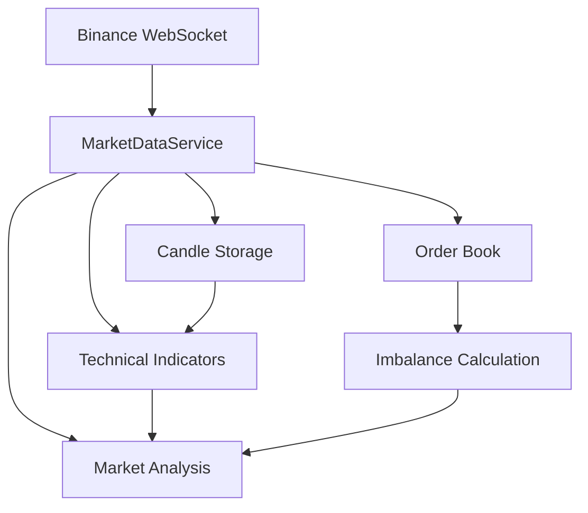

# Market Data Service Documentation

## Overview

The Market Data Service is a core component of our trading system that handles real-time market data collection, processing, and analysis for the TRUMP/USDC trading pair. It provides essential functionality for order book management, technical analysis, and price level optimization.

## Architecture



## Components

### 1. Candle Data Structure
```python
@dataclass
class Candle:
    timestamp: datetime
    open: float
    high: float
    low: float
    close: float
    volume: float
    trades: int
    vwap: Optional[float] = None
```
- Stores OHLCV (Open, High, Low, Close, Volume) data
- Includes trade count and VWAP (Volume-Weighted Average Price)
- Used for technical analysis and pattern recognition

### 2. Order Book Manager
```python
class OrderBook:
    def __init__(self, max_depth: int = 20):
        self.bids: Dict[float, float] = {}  # price -> quantity
        self.asks: Dict[float, float] = {}  # price -> quantity
```
- Maintains real-time order book state
- Tracks bid and ask orders up to specified depth
- Calculates volume imbalances for market analysis
- Auto-maintains maximum depth for memory efficiency

### 3. Market Data Service
```python
class MarketDataService:
    def __init__(self, symbol: str, candle_limit: int = 1000):
        self.symbol = symbol
        self.order_book = OrderBook()
        self.trades = deque(maxlen=1000)
        self.candles = deque(maxlen=candle_limit)
```

#### Key Features:
1. **Real-time Data Collection**
   - WebSocket connection to Binance
   - Automatic reconnection handling
   - Efficient data structures with size limits

2. **Technical Indicators**
   - Moving Averages (MA5, MA20)
   - VWAP (Volume-Weighted Average Price)
   - Order book imbalance

3. **Market Analysis**
   - Price level optimization
   - Volume profile analysis
   - Market state snapshots for AI

## Usage Examples

### 1. Starting the Service
```python
# Initialize the service
market_data = MarketDataService(symbol="TRUMPUSDC")

# Start data collection
market_data.start(api_key="your_api_key", api_secret="your_api_secret")
```

### 2. Getting Market Snapshot
```python
# Get current market state
snapshot = market_data.get_market_snapshot()
print(f"Current price: {snapshot['market_state']['current_price']}")
print(f"Order book imbalance: {snapshot['market_state']['order_book_imbalance']}")
```

### 3. Calculating Entry Levels
```python
# Get optimal entry prices for 10 USDC
entry_prices = market_data.get_optimal_entry_levels(usdc_amount=10)
print(f"Suggested entry prices: {entry_prices}")
```

## Data Formats

### 1. Market Snapshot Format
```json
{
    "market_state": {
        "current_price": 39.67,
        "order_book_imbalance": -0.02,
        "volume_profile": {
            "bid_volume": 15000,
            "ask_volume": 12000
        },
        "technical_indicators": {
            "ma5": 39.45,
            "ma20": 39.12,
            "vwap": 39.33
        }
    },
    "metadata": {
        "symbol": "TRUMPUSDC",
        "timestamp": "2024-01-21T11:30:00Z"
    }
}
```

### 2. Order Book Update Format
```json
{
    "e": "depthUpdate",
    "b": [["39.50", "1.234"]],  // Bids [price, quantity]
    "a": [["39.55", "0.567"]]   // Asks [price, quantity]
}
```

## Error Handling

The service implements comprehensive error handling:
1. WebSocket disconnection recovery
2. Invalid data validation
3. Error logging and reporting
4. Graceful degradation of services

## Performance Considerations

1. **Memory Management**
   - Fixed-size collections (deque) for trades and candles
   - Order book depth limitation
   - Efficient data structures for quick lookups

2. **CPU Optimization**
   - Incremental technical indicator updates
   - Lazy evaluation of expensive calculations
   - Efficient order book updates

3. **Network Efficiency**
   - WebSocket connection for real-time updates
   - Minimal payload processing
   - Automatic reconnection with backoff

## Future Improvements

1. **Planned Features**
   - Additional technical indicators (RSI, MACD)
   - Enhanced VWAP calculation
   - Historical data integration
   - More sophisticated entry price calculation

2. **Optimizations**
   - Parallel processing for indicators
   - Enhanced memory management
   - Performance monitoring
   - Caching frequently accessed data

## Integration Points

The Market Data Service integrates with:
1. Binance WebSocket API
2. Trading Engine
3. AI Strategy Module
4. Risk Management System

## Testing

To test the service:
1. Create a test instance with test API keys
2. Monitor WebSocket connection status
3. Verify data accuracy against Binance UI
4. Test error handling and recovery

## Security Notes

1. API Key Management
   - Use read-only API keys for market data
   - Never log sensitive data
   - Secure WebSocket connection

2. Data Validation
   - Validate all incoming data
   - Sanitize outputs
   - Handle edge cases gracefully 