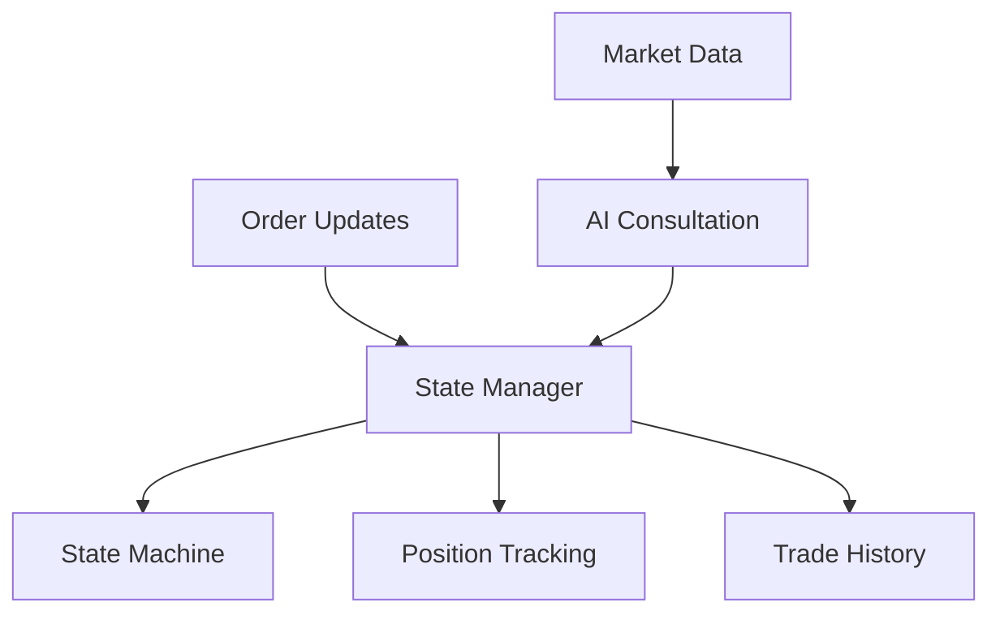

# State Manager Documentation

## Overview

The State Manager is responsible for maintaining the trading system's state, managing order lifecycle, and coordinating with the AI strategy module (DeepSeek via OpenRouter). It ensures the system transitions safely between states and maintains accurate trade records.

## Architecture



## Components

### 1. Trading States
```python
class TradingState(Enum):
    READY_TO_BUY = "ready_to_buy"
    BUYING = "buying"
    READY_TO_SELL = "ready_to_sell"
    SELLING = "selling"
```

State Transitions:
- READY_TO_BUY → BUYING (When placing buy order)
- BUYING → READY_TO_SELL (When buy order fills)
- BUYING → READY_TO_BUY (If buy order fails)
- READY_TO_SELL → SELLING (When placing sell order)
- SELLING → READY_TO_BUY (When sell order fills)
- SELLING → READY_TO_SELL (If sell order fails)

### 2. Data Structures

#### Position
```python
@dataclass
class Position:
    symbol: str
    quantity: Decimal
    entry_price: Decimal
    timestamp: datetime
```
Tracks current holding of TRUMP tokens.

#### Order
```python
@dataclass
class Order:
    id: str
    symbol: str
    side: str  # BUY or SELL
    quantity: Decimal
    price: Decimal
    status: str
    timestamp: datetime
```
Represents a single order in the system.

#### Trade
```python
@dataclass
class Trade:
    buy_order: Order
    sell_order: Optional[Order]
    profit_loss: Optional[Decimal]
    status: str  # OPEN or CLOSED
    timestamp: datetime
```
Represents a complete trade cycle (buy + sell).

## Core Functionality

### 1. State Management
```python
async def transition(self, new_state: TradingState, order: Optional[Order] = None) -> bool:
    """Attempt to transition to a new state"""
```
- Validates state transitions
- Updates current state
- Records active orders
- Logs state changes

### 2. Order Handling
```python
async def handle_order_update(self, order_update: Dict) -> None:
    """Handle order status updates"""
```
- Processes order status changes
- Updates positions
- Triggers state transitions
- Records trade outcomes

### 3. AI Integration
```python
async def consult_ai(self, market_data: Dict) -> Dict:
    """Consult DeepSeek via OpenRouter for trading decisions"""
```
- Sends market data to DeepSeek
- Receives trading recommendations
- Formats data for AI consumption
- Handles API errors gracefully

## Usage Examples

### 1. Initializing the Manager
```python
state_manager = StateManager(symbol="TRUMPUSDC")
```

### 2. Handling Order Updates
```python
await state_manager.handle_order_update({
    'orderId': "123",
    'status': 'FILLED',
    'quantity': "0.25",
    'price': "40.00"
})
```

### 3. Consulting AI
```python
market_data = market_data_service.get_market_snapshot()
ai_advice = await state_manager.consult_ai(market_data)
```

## AI Integration Details

### 1. AI Request Format
```json
{
    "model": "deepseek-ai/deepseek-coder-33b-instruct",
    "messages": [{
        "role": "user",
        "content": "Analyze market data and suggest prices..."
    }]
}
```

### 2. AI Response Format
```json
{
    "action": "buy",
    "base_price": 39.45,
    "price_range": [39.40, 39.50],
    "confidence": 0.85,
    "reasoning": "Strong buy pressure with positive order book imbalance"
}
```

## Error Handling

1. **State Transitions**
   - Validates all state changes
   - Prevents invalid transitions
   - Logs transition attempts

2. **Order Updates**
   - Validates order data
   - Handles missing fields
   - Processes partial fills

3. **AI Consultation**
   - Handles API timeouts
   - Validates responses
   - Provides fallback values

## Performance Considerations

1. **Memory Management**
   - Uses dataclasses for efficient storage
   - Maintains trade history in memory
   - Uses decimal for precise calculations

2. **Async Operations**
   - Async state transitions
   - Non-blocking AI consultation
   - Efficient order processing

## Security Notes

1. **API Keys**
   - Loads keys from environment
   - Never logs sensitive data
   - Validates API responses

2. **Data Validation**
   - Validates all inputs
   - Sanitizes AI responses
   - Protects against invalid states

## Testing

To test the State Manager:
1. Run `test_state_manager.py`
2. Monitor state transitions
3. Verify trade calculations
4. Test AI integration

Example test command:
```bash
python src/test_state_manager.py
```

## Integration Points

The State Manager integrates with:
1. Market Data Service
2. OpenRouter API (DeepSeek)
3. Order Execution System
4. Trade History Storage

## Future Improvements

1. **Planned Features**
   - Persistent trade history
   - Multiple AI model support
   - Enhanced profit calculations
   - Position sizing logic

2. **Optimizations**
   - Caching AI responses
   - Batch order processing
   - State recovery mechanisms
   - Performance metrics 