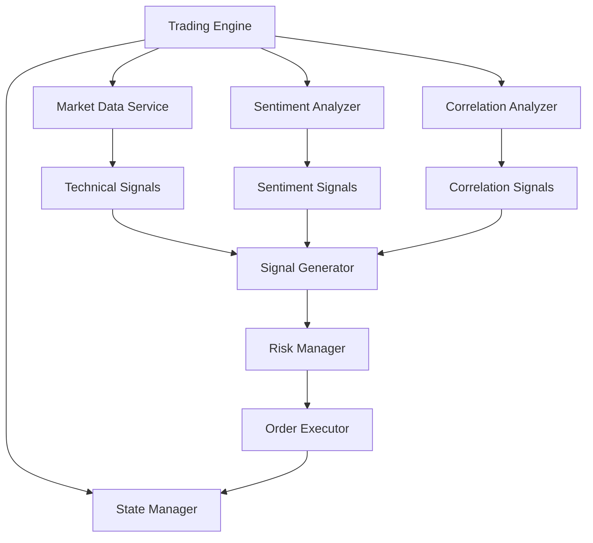

# Trading Engine Documentation

## Overview
The Trading Engine is the core decision-making component of the trading system, coordinating multiple services to generate and execute trading signals. It combines technical analysis, market sentiment, and correlation data to make informed trading decisions.

## Architecture



## Components

### 1. Signal Generation
- Combines signals from multiple sources:
  - Technical Analysis (40% weight)
  - Market Sentiment (30% weight)
  - BTC Correlation (30% weight)
- Generates confidence scores (0.0 to 1.0)
- Requires minimum confidence of 0.7 for execution

### 2. Risk Management
- Position sizing based on account balance
- Maximum 2% risk per trade
- Maximum position size of 1000 USDC
- Stop loss at 2% below entry
- Take profit at 5% above entry

### 3. Market Analysis
- Technical indicators (MA, RSI, MACD)
- Order book imbalance
- Market sentiment analysis
- BTC correlation tracking

### 4. Order Execution
- State-based order management
- Automated stop loss and take profit
- Position tracking
- Error handling and logging

## Configuration

```python
config = {
    'min_confidence': 0.7,           # Minimum confidence for trade execution
    'max_position_size': 1000,       # Maximum position size in USDC
    'risk_per_trade': 0.02,          # 2% risk per trade
    'technical_weight': 0.4,         # Weight for technical signals
    'sentiment_weight': 0.3,         # Weight for sentiment signals
    'correlation_weight': 0.3,       # Weight for correlation signals
    'stop_loss_pct': 0.02,          # 2% stop loss
    'take_profit_pct': 0.05         # 5% take profit
}
```

## Usage Example

```python
# Initialize services
market_data = MarketDataService(symbol="TRUMPUSDC")
sentiment_analyzer = SentimentAnalyzer()
correlation_analyzer = CorrelationAnalyzer()
state_manager = StateManager(symbol="TRUMPUSDC")

# Initialize trading engine
engine = TradingEngine(
    symbol="TRUMPUSDC",
    market_data=market_data,
    sentiment_analyzer=sentiment_analyzer,
    correlation_analyzer=correlation_analyzer,
    state_manager=state_manager
)

# Start trading
await engine.start()

# Get trading summary
summary = await engine.get_trading_summary()
print(summary)

# Stop trading
await engine.stop()
```

## Signal Generation Process

### 1. Technical Analysis
- Moving Average crossovers
- RSI (30/70 levels)
- MACD signals
- Order book imbalance

### 2. Sentiment Analysis
- Social media sentiment
- News sentiment
- Fear & Greed Index
- Market momentum

### 3. Correlation Analysis
- BTC price correlation
- Market dominance impact
- Trading volume correlation

## Risk Management

### Position Sizing
```python
position_size = min(
    balance * risk_per_trade,
    max_position_size
) / current_price
```

### Stop Loss and Take Profit
```python
stop_loss = entry_price * (1 - stop_loss_pct)
take_profit = entry_price * (1 + take_profit_pct)
```

## Testing

Run the test suite:
```bash
python src/test_trading_engine.py
```

The test suite verifies:
1. Signal generation
2. Market condition aggregation
3. Trading strategy execution
4. Risk management
5. Service integration

## Error Handling
- Graceful error recovery
- Automatic retry mechanism
- Comprehensive logging
- State consistency checks

## Future Improvements

1. Additional Strategies
   - Grid trading
   - Momentum trading
   - Mean reversion
   - Arbitrage

2. Enhanced Risk Management
   - Dynamic position sizing
   - Adaptive stop losses
   - Multiple take profit levels

3. Performance Optimization
   - Caching market data
   - Parallel signal processing
   - Optimized order execution

4. Machine Learning Integration
   - Pattern recognition
   - Predictive analytics
   - Risk assessment 