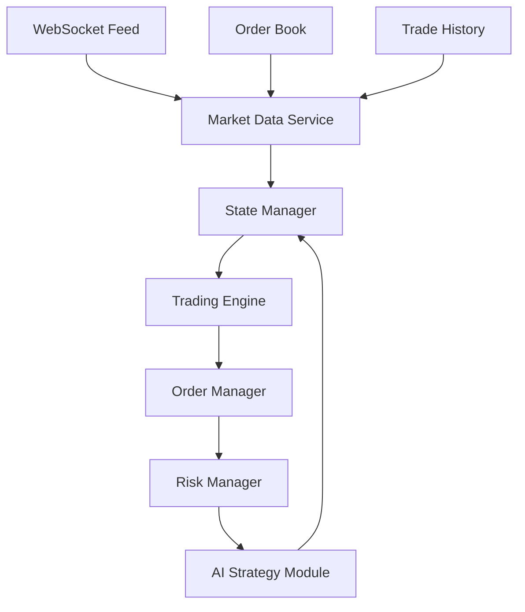

# TRUMP/USDC Autonomous Trading Bot: High-Frequency Strategy

## Core Strategy Overview

Our approach focuses on high-frequency trading with the TRUMP/USDC pair, optimizing for quick profits while maintaining strict risk controls. The strategy is built around a 10 USDC base investment per trade cycle.

### Key Differentiators

1. **Adaptive Margin Strategy**
   - Dynamic profit targets based on real-time market conditions
   - Fee-aware pricing (0.1% per trade = 0.2% round trip)
   - Margin calculation incorporates volume profile and order book depth

2. **Smart Order Routing**
   - Hybrid order approach: Limit orders with dynamic timeout
   - Automatic price adjustment based on order book pressure
   - Order size optimization based on available liquidity

3. **Real-time Market Analysis**
   - Order book imbalance monitoring
   - Volume profile analysis
   - Price momentum indicators

## System Architecture



### Components Breakdown

#### 1. Market Data Service (`market_data.py`)
```python
class MarketDataService:
    def __init__(self):
        self.price_cache = deque(maxlen=1000)  # Last 1000 price points
        self.volume_profile = {}  # Price levels -> volume
        self.order_book = OrderBook()  # Maintains bid/ask levels
        
    def update_price(self, price_data):
        self.price_cache.append(price_data)
        self.analyze_momentum()
        
    def get_order_book_imbalance(self):
        return (self.order_book.bid_volume - self.order_book.ask_volume) / \
               (self.order_book.bid_volume + self.order_book.ask_volume)
```

#### 2. State Manager (`state_manager.py`)
```python
class StateManager:
    States = Enum('States', ['READY_TO_BUY', 'BUYING', 'READY_TO_SELL', 'SELLING'])
    
    def __init__(self):
        self.current_state = self.States.READY_TO_BUY
        self.position = Position()  # Tracks current TRUMP holdings
        self.last_trade = None
        
    async def transition(self, new_state, trade_data=None):
        if self._is_valid_transition(new_state):
            self.current_state = new_state
            if trade_data:
                self.last_trade = trade_data
```

#### 3. Trading Engine (`trading_engine.py`)
```python
class TradingEngine:
    def __init__(self, market_data, state_manager, risk_manager):
        self.market_data = market_data
        self.state = state_manager
        self.risk = risk_manager
        self.order_timeout = 120  # 2 minutes default
        
    async def execute_cycle(self):
        if self.state.current_state == States.READY_TO_BUY:
            await self._execute_buy_strategy()
        elif self.state.current_state == States.READY_TO_SELL:
            await self._execute_sell_strategy()
            
    async def _execute_buy_strategy(self):
        price_levels = self.market_data.get_optimal_entry_levels(10)  # 10 USDC
        order = await self._place_smart_order('BUY', price_levels)
        await self._monitor_order(order, self.order_timeout)
```

#### 4. Risk Manager (`risk_manager.py`)
```python
class RiskManager:
    def __init__(self):
        self.max_slippage = 0.002  # 0.2% max slippage
        self.min_profit_margin = 0.003  # 0.3% min profit (after fees)
        
    def validate_trade(self, order_params):
        return (
            self._check_slippage(order_params.price) and
            self._check_liquidity(order_params.size) and
            self._check_profit_potential(order_params)
        )
        
    def calculate_optimal_margin(self, market_data):
        volatility = market_data.get_volatility()
        book_pressure = market_data.get_order_book_imbalance()
        return self._adaptive_margin_formula(volatility, book_pressure)
```

### AI Integration Strategy

1. **Market Analysis Request**
```json
{
    "market_state": {
        "current_price": 39.67,
        "order_book_imbalance": -0.02,
        "volume_profile": {
            "below_market": 15000,
            "above_market": 12000
        },
        "momentum": {
            "price_change_1m": 0.15,
            "volume_change_1m": -0.05
        }
    },
    "trading_context": {
        "last_trade_profit": 0.12,
        "avg_fill_time": 45,
        "success_rate": 0.92
    }
}
```

2. **AI Response Format**
```json
{
    "buy_strategy": {
        "base_price": 39.45,
        "price_range": [39.40, 39.50],
        "confidence": 0.85,
        "timeout": 90
    },
    "sell_strategy": {
        "base_price": 39.85,
        "price_range": [39.80, 39.90],
        "confidence": 0.82,
        "timeout": 120
    },
    "market_analysis": {
        "volatility_forecast": "medium",
        "volume_forecast": "increasing",
        "suggested_margin": 0.008
    }
}
```

### Efficiency Optimizations

1. **Memory Management**
   - Use circular buffers for price history
   - Implement LRU cache for frequently accessed calculations
   - Maintain order book as skip list for O(log n) updates

2. **Network Optimization**
   - WebSocket connection pooling
   - Heartbeat monitoring with exponential backoff
   - Batch updates for non-critical data

3. **Computation Efficiency**
   - Parallel processing for AI consultation
   - Incremental calculations for technical indicators
   - Lazy evaluation of expensive metrics

### Error Recovery

1. **Order State Recovery**
```python
async def recover_state():
    # 1. Fetch all open orders
    open_orders = await binance.fetch_open_orders('TRUMP/USDC')
    
    # 2. Check balances
    balances = await binance.fetch_balance()
    trump_balance = balances['TRUMP']['free']
    
    # 3. Determine state
    if trump_balance > 0:
        return States.READY_TO_SELL
    elif open_orders:
        return States.BUYING if open_orders[0]['side'] == 'buy' else States.SELLING
    else:
        return States.READY_TO_BUY
```

2. **WebSocket Recovery**
```python
class WebSocketManager:
    async def maintain_connection(self):
        while True:
            try:
                if time.time() - self.last_heartbeat > 10:
                    await self.reconnect()
            except Exception as e:
                logger.error(f"WebSocket error: {e}")
                await self.reconnect(backoff=True)
            await asyncio.sleep(1)
```

### Performance Monitoring

1. **Key Metrics**
   - Fill rate (orders filled / orders placed)
   - Average fill time
   - Profit per trade (after fees)
   - AI prediction accuracy
   - System latency

2. **Logging Strategy**
```python
class PerformanceLogger:
    def log_trade(self, trade_data):
        metrics = {
            'timestamp': trade_data.timestamp,
            'buy_price': trade_data.buy_price,
            'sell_price': trade_data.sell_price,
            'fill_time': trade_data.fill_duration,
            'profit': trade_data.profit,
            'fees': trade_data.fees,
            'market_conditions': self.get_market_snapshot()
        }
        self.trade_log.append(metrics)
```

## Implementation Phases

1. **Phase 1: Core Infrastructure**
   - Basic order execution
   - State management
   - WebSocket integration

2. **Phase 2: Smart Order Routing**
   - Dynamic timeout adjustment
   - Order book analysis
   - Price improvement logic

3. **Phase 3: AI Integration**
   - Market analysis
   - Profit optimization
   - Strategy refinement

4. **Phase 4: Performance Optimization**
   - Memory optimization
   - Latency reduction
   - Throughput improvement

## Next Steps

1. Implement core components with proper error handling
2. Set up monitoring and logging infrastructure
3. Begin with conservative margins and gradually optimize
4. Collect performance data for AI training
5. Regular strategy review and adjustment

## Questions for Consideration

1. Should we implement partial fill handling for faster execution?
2. Do we want to add support for multiple AI models and strategy voting?
3. Should we implement a circuit breaker for unusual market conditions? 